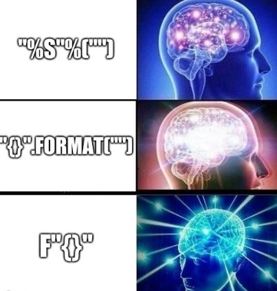

<!-- _class: title -->

# Regular-Expression in Python
<br/>

[Moeein Aali](https://github.com/MoeeinAali/)
Sharif University of Technology
CE153 - Fundamentals of Programming - Fall 2024
Dr. Mohammad Nazari

---

<!-- _class: tinytext -->

# String Operators

| Operator | Functionality                                                                 |
|----------|-------------------------------------------------------------------------------|
| `+`      | Concatenates two strings and returns the result.                             |
| `*`      | Repeats a string a specified number of times and returns the result.         |
| `in`     | Returns `True` if the string before the operator is found in the string after it, otherwise `False`. |
| `not in` | The opposite of the `in` operator, returns `True` if the string before the operator is not found in the string after it. |


---

<!-- _class: tinytext -->

# String Operators

```shell
>>> s = 'salam'
>>> t = 'ali'
>>> s + t
'salamali'
>>> s * 3
'salamsalamsalam'
>>> 'ai' in s
False
>>> 'al' in s
True
>>> 'ai' not in s
True
>>> 'al' not in s
False
```

---

<!-- _class: tinytext -->

# Access Chars in Strings

By using the `[:]` operator, this functionality is possible. This operator takes two integers, `l` and `r`, and returns a substring formed by concatenating the elements from the `l`-th index up to (but not including) the `r`-th index, in the format `[l, r)`. If `l` is not provided, it defaults to `0`, and if `r` is not provided, it defaults to the length of the string. Additionally, if either of these indices is negative, the length of the string minus the absolute value of the index is used instead. For better understanding, consider the following examples:

```shell
>>> s = 'salam'
>>> s[1:4]
'ala'
>>> s[1:]
'alam'
>>> s[:3]
'sal'
>>> s[4:3]
''
>>> s[:]
'salam'
>>> s[-3:-1]
'la'
```

---

<!-- _class: tinytext -->

# Access Chars in Strings

```shell
>>> s[-3:]
'lam'
>>> s[:-1]
'sala'
>>> s[-3:4]
'la'
>>> s[-4:3]
'al'
```

- `[start:stop:step]`
salam
```shell
>>> s[::-1]
'malas'
>>> s[0:4:2]
'sl'
```

---


<!-- _class: tinytext -->

# String Functions

| Operator   | Functionality                                                                 |
|------------|------------------------------------------------------------------------------|
| `lower()`  | Converts all characters in the string to lowercase and returns the result.   |
| `upper()`  | Converts all characters in the string to uppercase and returns the result.   |
| `isalpha()`| Returns `True` if all characters in the string are alphabetic; otherwise `False`. |
| `isdigit()`| Returns `True` if all characters in the string are numeric digits; otherwise `False`. |
| `zfill(x)` | Pads the beginning of the string with `0`s until the string's length equals `x`. |


---

<!-- _class: tinytext -->

# String Functions

```shell
>>> 'Ali23'.lower()
'ali23'
>>> 'Ali23'.upper()
'ALI23'
>>> 'Ali23'.isalpha()
False
>>> 'Ali'.isalpha()
True
>>> 'Ali23'.isdigit()
False
>>> '23'.isdigit()
True
>>> 'Ali23'.zfill(2)
'Ali23'
>>> 'Ali23'.zfill(8)
'000Ali23'
```

---


<!-- _class: tinytext -->

# String Functions

| Operator     | Functionality                                                                                             |
|--------------|----------------------------------------------------------------------------------------------------------|
| `count()`    | Returns the number of occurrences of the input substring within the main string.                         |
| `find()`     | Takes a substring and returns the index of its first occurrence in the main string. Returns `-1` if not found. |
| `split()`    | Takes a delimiter string and splits the main string at each occurrence of the delimiter, returning a list of substrings. |
| `replace()`  | Takes two substrings and replaces every occurrence of the first substring in the main string with the second substring. |


---

<!-- _class: tinytext -->

# String Functions

```sh
>>> 'ahmad'.count('ma')
1
>>> 'ahmad'.count('ali')
0
>>> 'aaaa'.count('aa')
2
>>> 'ahmad'.find('ali')
-1
>>> 'ahmad'.find('ma')
2
>>> 'Hello world!'.split(' ')
['Hello', 'world!']
>>> 'Hello world!'.split('l')
['He', '', 'o wor', 'd!']
>>> 'Hello world!'.replace('l', 'salam!')
'Hesalam!salam!o worsalam!d!'
>>> len('Hello')
5
>>> 'HeLLo'.replace('LL', 'll')
'Hello'
```

---

# String Functions

#### String Immutability 

All the functions mentioned above do not modify the original string but only return the result. If you want to apply changes to the string, you need to reassign the value to the original string. To understand this better, consider the following example:

```sh
>>> s = 'mokar'
>>> s.replace('m', 'l').upper()
'LOKAR'
>>> s
'mokar'
>>> s = s.replace('m', 'l').upper()
>>> s
'LOKAR'
```

---


# String Functions


#### removeprefix , removesuffix

```sh
>>> s = 'spartacus'
>>> s.removeprefix('s')
'partacus'
>>> s.removeprefix('spar')
'tacus'
>>> s.removeprefix('part')
'spartacus'
>>> s.removesuffix('s')
'spartacu'
>>> s.removesuffix('acus')
'spart'
>>> s.removesuffix('tacu')
'spartacus'
```
---


# String Formatting

#### f-string

```python
age = 12
height = 178.5
isMale = True
f'Age : {age}, Height : {height}, Gender : {isMale}'
```

```sh
>>> variable = 5
>>> f"{variable=}"
'variable=5'
```

---

# String Formatting



---


# String Formatting

#### formatting with %

```python
greeting = "Hello %s with %d years old!"
name = input("Please enter your name:\n")
age = int(input("Please enter your age:\n"))
print(greeting % (name, age))
```

- If the number of values provided in the parentheses does not match the number of placeholders required by the string, the interpreter will raise an exception. Additionally, if you want to include the `%` character in your string, you can use `%%`.

- To store floating-point numbers with a specified precision, you can use `%.Xf`, where `X` is the number of decimal places you want to print. (For example, to store a floating-point number with two decimal places, you can use `%.2f`.)

---

<!-- _class: tinytext -->

# String Formatting

### formatting with `format()`

Another method for string formatting, which can simplify the process, is using the `.format()` method. This method, available only in Python 3, is one of the features that distinguish Python 3 from its earlier versions.

In this approach, placeholders within the string are marked with `{}`. Then, the `format` function is called on the string with the values to replace these placeholders. The output will be a string where each `{}` is replaced with the corresponding value provided in the `format` function in order.

For example, consider rewriting the earlier example using this method:
```python
greeting = "Hello {} with {} years old!"
name = input("Please enter your name:\n")
age = int(input("Please enter your age:\n"))
print(greeting.format(name, age))
```

---

<!-- _class: tinytext -->

# String Formatting

| Format      | Functionality                                                                                       |
|-------------|---------------------------------------------------------------------------------------------------|
| `{:+}`      | Adds a `+` sign before the number if it is non-negative.                                           |
| `{:.Xf}`    | Formats the number with `X` decimal places.                                                        |
| `{:b}`      | Converts the given number to its binary representation and places it in the string.                |
| `{:o}`      | Converts the given number to its octal representation and places it in the string.                 |
| `{:x}`      | Converts the given number to its hexadecimal representation and places it in the string.           |
| `{:x=y}`    | Pads the string with the character `x` at the beginning until its length is equal to `y`.          |

---

# String Formatting


Example:

```sh
>>> "{:+} {:+} {:+}".format(241.1, -124.21, 0)
'+241.1 -124.21 +0'
>>> "{:.3f} {:.3f}".format(122, 33.22191)
'122.000 33.222'
>>> "{:b} {:b}".format(-34, 21)
'-100010 10101'
>>> "{:x} {:x}".format(241, 124)
'f1 7c'
>>> "{:o} {:o}".format(241, 124)
'361 174'
>>> "{:0=8} {:1=8} {:2=2}".format(12, 21.12, 312)
'00000012 11121.12 312'
```

---

# String Formatting


Example:

```sh
>>> "Hello {0} with {1} years old!".format("Ali", "23")
'Hello Ali with 23 years old!'
>>> "Hello {name} with {age} years old!".format(name = "Ali", age = "23")
'Hello Ali with 23 years old!'
>>> "Hello {0} with {age} years old!".format("Ali", age = "23")
'Hello Ali with 23 years old!'
```
Example:

```sh
>>> "{0:.3f} {0:+}".format(23.12)
'23.120 +23.12'
>>> "{num:.3f} {num:+}".format(num=23.12)
'23.120 +23.12'
```
---

# RegEx


---

<!-- _class: tinytext -->

# RegEx

### The `.` Symbol
The `.` symbol matches any single character. For example, the following strings match the pattern `....`:

- `"abcd"`
- `"$^%#"`
- `"1234"`

### The `\` Symbol

The `\` symbol is used to escape special characters so that they can be treated as their literal selves. For example, if you want to match the `.` character specifically (and not use it as a wildcard), you can use `\.`. This ensures that it matches only the `.` character and not other characters.

In some cases, `\` also gives special meaning to certain letters, which will be explained later.

- `"abc."` → Match
- `"123."` → Match
- `"defg"` → No match
---

<!-- _class: tinytext -->

# RegEx

### The `\d` Symbol

The `\d` symbol matches any digit (characters `0` to `9`). It is commonly used to find numeric characters in strings.

Consider the pattern `.sd\d`. This pattern matches the first two strings but not the last one, because the last character in the third string is not a digit:

- `"asd7"` → Match
- `"6sd1"` → Match
- `"dsdg"` → No match

### The `\D` Symbol

The `\D` symbol matches any character that is **not a digit** (i.e., not `0-9`). 

Consider the pattern `.\D`. This pattern matches the first two strings but not the last one, because the last character in the third string is a digit:

- `"bQ"` → Match
- `"6s"` → Match
- `"d5"` → No match

---

<!-- _class: tinytext -->

# RegEx

### The `\w` Symbol

The `\w` symbol matches any **alphanumeric character** (letters `a-z`, `A-Z`, digits `0-9`) and the underscore `_`.

For the pattern `\w\w`, this matches the first two strings but not the last one, as it contains non-alphanumeric characters:

- `"aB"` → Match
- `"6_"` → Match
- `"<?"` → No match

### The `\W` Symbol

The `\W` symbol matches any character **that is not alphanumeric** (not letters `a-z`, `A-Z`, digits `0-9`, or the underscore `_`).

For the pattern `..\W`, this matches the first two strings but not the last one, as the last character in the third string is numeric:

- `"bQ@"` → Match
- `"6_!"` → Match
- `"d56"` → No match


---

<!-- _class: tinytext -->

# RegEx

### The `+` Symbol

The `+` symbol indicates that the preceding character must appear **one or more times**. It can be combined with other symbols for complex patterns.

For the pattern `sx+`, it matches the first two strings but not the third, as the third string does not have an `x`:

- `"sx"` → Match
- `"sxxx"` → Match
- `"s"` → No match


### The `*` Symbol

The `*` symbol indicates that the preceding character can appear **zero or more times**. It can also be combined with other symbols for flexible patterns.

For the pattern `sx*`, it matches all three strings because `x` can appear zero or more times:

- `"sx"` → Match
- `"sxxx"` → Match
- `"s"` → Match


---

<!-- _class: tinytext -->

# RegEx

### The `?` Symbol

The `?` symbol means that the preceding character can appear **zero or one time**. This allows for optional characters in the string. It can also be combined with other symbols for more complex patterns.

For the pattern `d?e?f`, it matches the first four strings but not the fifth, because in the fifth string, the character `e` is repeated more than once:

- `"df"` → Match
- `"ef"` → Match
- `"f"` → Match
- `"def"` → Match
- `"deef"` → No match

---

<!-- _class: tinytext -->

# RegEx

### The `{}` Symbol

The `{}` symbol specifies the exact or range of repetitions for the preceding character or pattern.

- `a{23}`: Matches exactly 23 occurrences of the character `a`.
- `g{4,9}`: Matches between 4 and 9 occurrences of the character `g`.

This symbol can also combine with other symbols to repeat more complex patterns a specified number of times.

For the pattern `.{3,8}`, it matches the first three strings but not the fourth, as the fourth string's length is not within the range of 3 to 8:

- `"@!#$"` → Match
- `"IAmAli"` → Match
- `"12345678"` → Match
- `"Hi"` → No match


---

# RegEx

### The `[]` Symbol

The `[]` symbol allows you to specify a set of characters that can match a single position in the string. It matches exactly **one character** from the specified set. Once a match is found, the pattern continues checking subsequent characters.

For the pattern `[abc][def][ghi]`, it matches the first two strings but not the third, because the second and third characters in the third string are not in the specified sets:

- `"beg"` → Match
- `"cdi"` → Match
- `"abc"` → No match

---


# RegEx

### Ranges in `[]`

To specify a range of characters, use a `-` between the start and end characters. For example:
- `[H-M]` matches any uppercase letter from `H` to `M`, inclusive. This is equivalent to `[HIJKLM]`.

For the pattern `[i-p]`, it matches the first three strings but not the fourth, because `x` is not between `i` and `p`:

- `"o"` → Match
- `"i"` → Match
- `"p"` → Match
- `"x"` → No match

---

# RegEx

### Negation with `^`

If you add a `^` at the beginning of the `[]`, it negates the set. The pattern matches any character **not in the specified set**.

For the pattern `abc[^def]`, it does not match the first two strings but matches the third, because the last character is not one of `d`, `e`, or `f`:

- `"abcd"` → No match
- `"abcf"` → No match
- `"abck"` → Match

---

# RegEx

### The `()` Symbol

The `()` symbol is used to group characters or patterns in a regular expression. This is especially useful when applying quantifiers (such as `+`, `*`, `{}`, etc.) to a group of characters, instead of applying them to a single character.

For the pattern `(abc)+`, it matches the first two strings but not the third, because the third string contains the character `d` which is not part of the group:

- `"abcabcabc"` → Match
- `"abc"` → Match
- `"abdccccc"` → No match

---

<!-- _class: tinytext -->

# RegEx

### The `^` Symbol

The `^` symbol, when placed at the beginning of a pattern, means that the string must **start** with the given pattern.

For the pattern `^Mah.+`, it matches the first two strings but not the third, because the third string does not start with `Mah`:

- `"Mahtab"` → Match
- `"Mahan"` → Match
- `"TabMah"` → No match

### The `$` Symbol

The `$` symbol, when placed at the end of a pattern, means that the string must **end** with the given pattern.

For the pattern `.+pour$`, it matches the first two strings but not the third, because the third string does not end with `pour`:

- `"Alipour"` → Match
- `"Rashidpour"` → Match
- `"pourMansour"` → No match

<hr>

**Validate your regular expressions with [this link](https://regex101.com/).**

---

<!-- _class: tinytext -->

# RegEx in Python

```python
import re
```

### Function: `match`

This function takes two strings, `pattern` and `s`, as input arguments and checks whether the string `s` matches the regular expression `pattern`. The output of the `match` function can be used in a conditional statement. Consider the following example:

```python
pattern = '\d\d\d$'
s = input()
if re.match(pattern, s):
    print('matched')
else:
    print('not matched')
```


---

# RegEx in Python

### Function: `findall`

This function takes two strings as input and returns a list as output. This list contains all substrings from the second string that match the RegEx pattern (the first input string). See the example below:

```sh
>>> re.findall("e[a-z]", "regex college")
['eg', 'ex', 'eg']
>>> re.findall("python", "regex college")
[]
```

---

<!-- _class: tinytext -->

# RegEx in Python

### Function: `search`

This function works similarly to the `findall` function, but instead of returning a list, it returns a `Match Object`. This object refers to the first occurrence of the pattern. Related methods of the `Match Object` can be seen in the example below:

```sh
>>> x = re.search("e[a-z]", "regex college")
>>> type(x)
<class '_sre.SRE_Match'>
>>> x.string
'regex college'
>>> x.span()
(1, 3)
>>> x.group()
'eg'
```

- **`span()`**: This method returns a tuple containing the start and end indices of the match (in a half-open interval).  
- **`group()`**: This method returns the substring that matches the pattern.  
- If no match is found, the `search` function returns `None`.

---

<!-- _class: tinytext -->

# RegEx in Python

### Function: `split`

The `split` function works similarly to Python's built-in `split` function, but instead of splitting by a string, it uses a pattern. This function takes a pattern and a string as input and splits the string wherever the pattern matches, returning the resulting parts as a list.

The operation begins from the start of the string. At each step:
- If a substring starting from the current index matches the pattern, it is removed, and the part before the pattern is added to the result.
- If multiple substrings match the pattern, the substring with the longest match is chosen.
- If no substring matches or the end of the string is reached, the remaining string is added to the result.

```sh
>>> re.split('a', 'salam')
['s', 'l', 'm']
>>> re.split('[0-9]+', 'you92398can820split729with26numbers')
['you', 'can', 'split', 'with', 'numbers']
>>> re.split('[a-z]+', '2093ab20a120dk')
['2093', '20', '120', '']
```

---

<!-- _class: tinytext -->

# RegEx in Python

### Function: `sub`

The `sub` function works similarly to Python's `replace` function, but instead of using a specific substring to find replacement locations, it uses a pattern. This function takes a pattern and two strings as input. Wherever the pattern matches in the second string, it replaces the match with the first string.

The pattern matching process is similar to that in the `split()` function.

```sh
>>> re.sub('l', 'salam', 'hello')
'hesalamsalamo'
>>> re.sub('[0-9]', '_digit_', '12ab1')
'_digit__digit_ab_digit_'
>>> re.sub('[0-9]+', '_num_', '12ab1129h')
'_num_ab_num_h'
```

---

<!-- _class: tinytext -->

# RegEx in Python

## Let's see some exmaples!

- [Practice Problems - Regular Expressions](https://runestone.academy/ns/books/published/py4e-int/regex/hp-practice.html)
- [Practice Problems - Advanced Regular Expressions](https://runestone.academy/ns/books/published/py4e-int/regex/hp-practice-adv.html)


